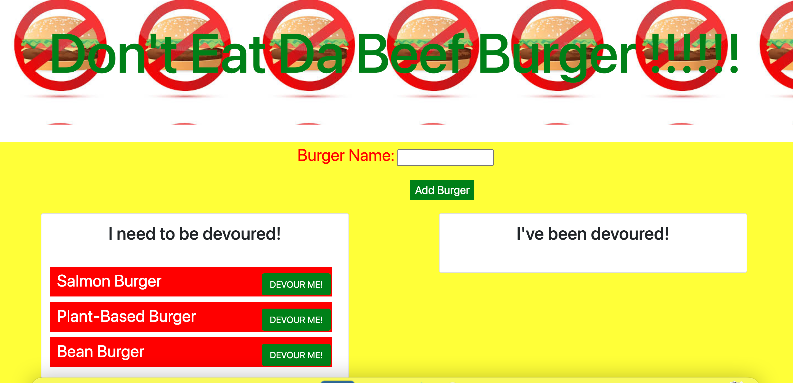

# Burger
[Live Deployement](https://donteatdaburger.herokuapp.com/)

 

## Description

   
---
In this assignment, you'll create a burger logger with MySQL, Node, Express, Handlebars and a homemade ORM (yum!). Be sure to follow the MVC design pattern; use Node and MySQL to query and route data in your app, and Handlebars to generate your HTML.
    
## Table of Contents 
     
---
* [Installation](#Installation)
* [UserStory](#UserStory)
* [Usage](#Usage)
* [Credits](#Credits)
* [License](#License)
* [Badges](#Badges)
* [Questions](#Questions|Comments|Concerns)
    
---
## Installation

`npm init` , `npm mysql` , `npm express`, `npm express-handlebars`

---

## UserStory

No user story.

---

## Usage 

No examples.

---

## Credits 

No collaborators

---

## License

---

## Badges 

---

## Questions|Comments|Concerns

https://github.com/imanid-code

imanidillahunt@gmail.com
---
